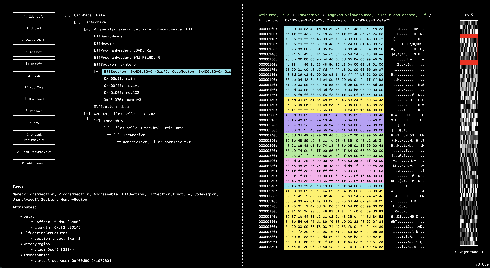
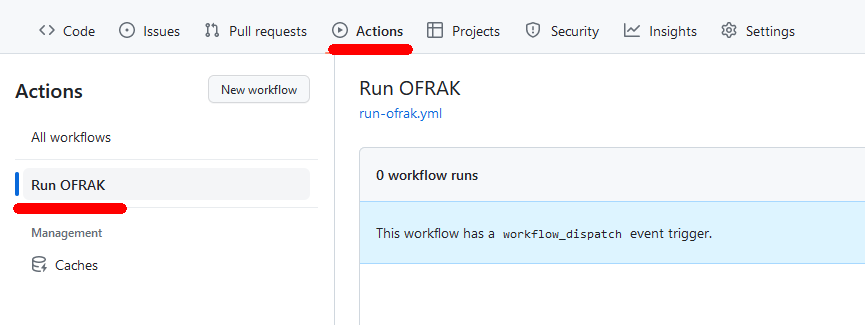
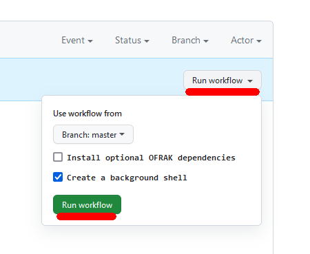
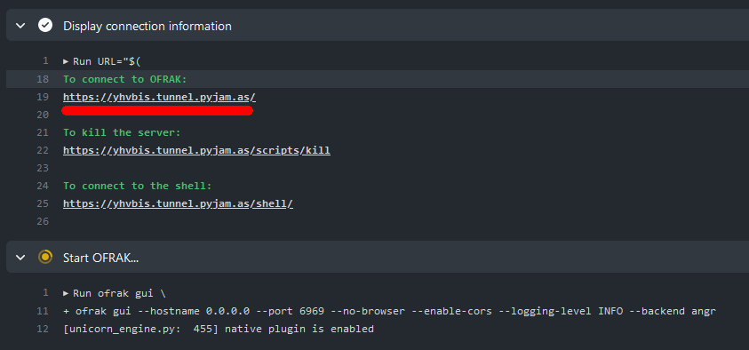
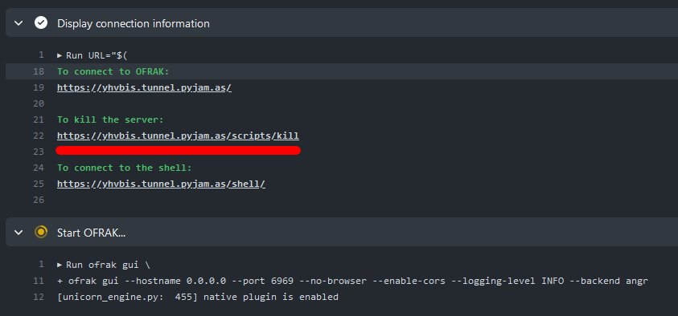

# Remote OFRAK

[OFRAK is a binary analysis and modification framework.](https://ofrak.com) It
has a web-based GUI for exploration, and a Python API for automation. The GUI
automatically generates Python scripts from users' actions, making it easy to
transition from exploration to automation. [Check it out on
GitHub.](https://github.com/redballoonsecurity/ofrak)

This project makes it possible to remotely run an OFRAK instance entirely from
your browser, without installing anything. This is great for:

- Trying out OFRAK without committing to setting it up
- Working on an OFRAK project with multiple people, such as when [using OFRAK
  for CTF
  problems](https://gist.github.com/marczalik/64405297dcae52d527020102c66eb21b)
- Using OFRAK on a computer where you do not have permission to install
  software, such as at school or the library
- Using OFRAK on a mobile device like an iPad or VR headset

# Quick Start

1. Make sure you are logged into GitHub. A GitHub account is required.
1. [Create your own copy of this repository by clicking this
   link.](https://github.com/jstrieb/remote-ofrak/generate)
1. [Go to the "Actions" tab of your new repository, and press "Run OFRAK" on
   the left.](../../actions/workflows/run-ofrak.yml)

   

   
   

1. Run the GitHub Actions workflow.

   

   
   

1. Click the link to access OFRAK.

   

   
   

1. Profit...
1. Use the "kill" link to terminate the Actions workflow cleanly. The workflow
   is automatically killed after six hours, but you should kill it manually
   when you are done to avoid wasting resources.

   

   
   

# Disclaimer

I work on OFRAK as part of my day job at [Red Balloon
Security](https://redballoonsecurity.com). This project was made outside of
work, and was not sanctioned by Red Balloon. The code is based, in-part, on my
[CTF Collab](https://github.com/jstrieb/ctf-collab) project from a few years
ago. 

All connection data is sent over a tunnel using
[`tunnel.pyjam.as`](https://tunnel.pyjam.as/). This service is generously
provided for public use. I do not operate it. Please don't abuse it! Also,
don't use it for sensitive or private data. Run OFRAK locally for that.
Alternatively, [self-host your own tunnel](https://gitlab.com/pyjam.as/tunnel).

# Greetz

- Wyatt Ford, Edward Larson, and the [others who have worked on
  OFRAK](https://github.com/redballoonsecurity/ofrak/graphs/contributors)
- [Logan Snow](https://github.com/lsnow99)
- [`pyjam.as`](https://pyjam.as/)

